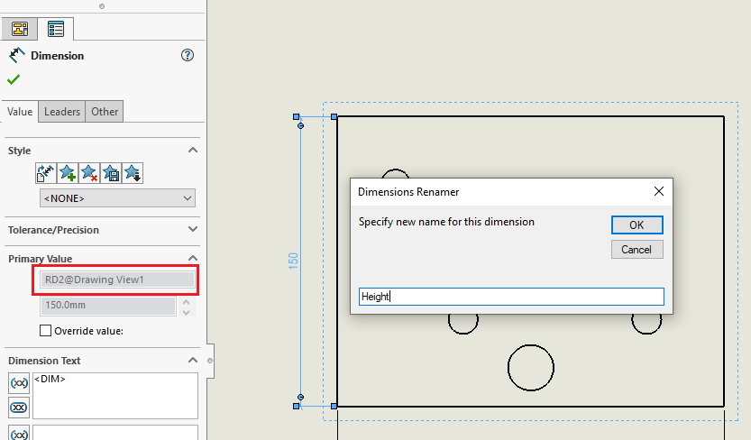
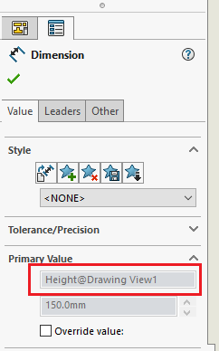

SOLIDWORKS allows assigning the custom dimension names in the 3D documents (parts and assemblies).

However dimension name is read-only and cannot be changed for the dimensions in the drawing view.

In some cases it might be beneficial to assign the custom name to dimensions in the drawing views. For example when dimensions are part of the [inspection report](/solidworks-api/document/drawing/export-dimensions/) or a part of drawings automation software such as DriveWorks.

This VBA macro allows to assign the custom name of the dimensions in the drawing views.

Select the dimension which name should be changed and run the macro.

Specify new name in the appeared box.

{width=600}

After the name is specified dimension name is set to new value.

