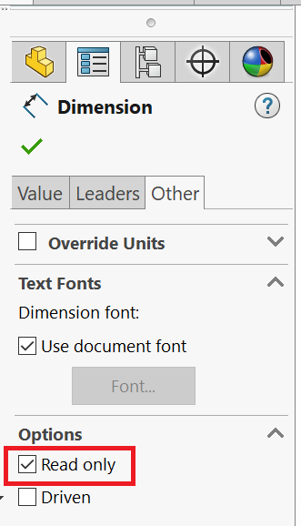

{ width=400 }

This SOLIDWORKS VBA macro changes the read-only state of all dimensions of the selected feature (e.g. sketch).

Set the target read-only state in the constant

~~~ vb
Const READ_ONLY As Boolean = True 'True to set to Read-Only, False to remove Rea-Only flag
~~~

