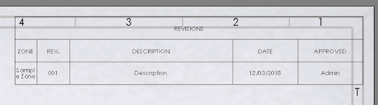

This example finds the revision table and removes all revisions and then adds new row with custom data using SOLIDWORKS API.

{ width=640 }

Set the name of the revision in the **INITIAL_REV** constant

~~~ vb
Const INITIAL_REV As String = "A" 'create new revision A
~~~

Fill the values of the revision table columns in the **COLUMNS** variable. use an empty string **""** to keep the default value (e.g. date or revision)

~~~ vb
COLUMNS = Array("First Column Value", "", "Third Column Value", "", "Fifth Column Value") 'Fill the 1st, 3rd and 5th columns with the values and keep 2nd and 4th columns default value
~~~

In order to process all open drawings, instead of the active drawing, set the **ALL_DRAWINGS** constant to **True**

~~~ vb
Const ALL_DRAWINGS As Boolean = True 'process all open drawings
~~~

[IRevisionTableAnnotation](https://help.solidworks.com/2018/english/api/sldworksapi/solidworks.interop.sldworks~solidworks.interop.sldworks.irevisiontableannotation.html) SOLIDWORKS API interface is used to manage specific functionality of this type of the table.

> Only revisions table on the first sheet are supported

