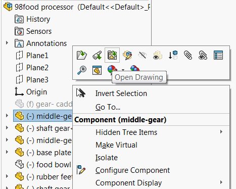
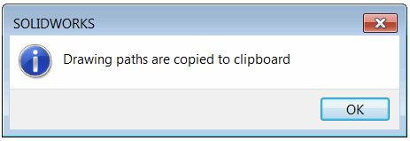
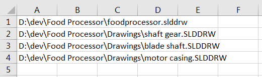

This VBA macro finds all the drawings which were created for all components of the active assembly using SOLIDWORKS API and puts the paths to the clipboard.

SOLIDWORKS provides the functionality to open the drawings of the component:

This feature allows to find drawings one-by-one, but sometimes it is required to quickly find all drawings used by components of this assembly. This can be a part of automation software. This macro will traverse all the references and find all drawings paths. Once completed the confirmation message below is displayed.

The content of the clipboard can be pasted into any text or table editor, like Notepad or Excel (use ctrl+V shortcut or Paste command).

## Notes

* Suppressed components are excluded from the search
* Drawings are searched in the same folder as the input assembly (including sub folders)
* Drawings are searched by reference, rather than by name, so drawing can have any name
* Drawing paths are separated with a new line symbol


