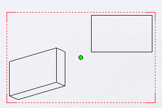

{ width=350 }

All drawing views in the drawing document have their own sketches which can be retrieved via [IView::GetSketch](https://help.solidworks.com/2019/english/api/sldworksapi/solidworks.interop.sldworks~solidworks.interop.sldworks.iview~getsketch.html) SOLIDWORKS API method.

This is a sketch where sketch entities and points can be drawn using the [ISketchManager](https://help.solidworks.com/2019/english/api/draftsightapi/Interop.dsAutomation~Interop.dsAutomation.ISketchManager.html) interface.

Unlike [creating sketch segment in the sheet space](/solidworks-api/document/drawing/sheet-context-sketch/), segments added to a view sketch will move together with the view and will be scaled and rotated in case of 3D rotation of the view.

Similar to the sketches in the assembly or part it is required to transform the coordinates from the model space into the sheet space in order to properly position the segments.

The following example demonstrates how to find the middle point of the drawing view (in sheet coordinate system) and draw this point directly in the view using SOLIDWORKS API using the transformation.


