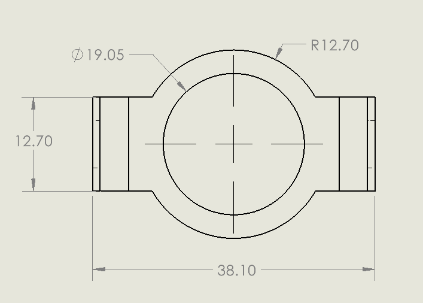

This VBA macro allows to export information of all dimensions in the active drawing to the CSV file which can be opened by Excel.

Macro includes the following information into the report:

* Name - full name of the dimension
* Owner - name of the drawing view or sheet this dimension belongs to
* Type - type of the dimension (e.g. linear, angular, ordinate, etc.)
* X - X position of the dimension in the current drawing units
* Y - Y position of the dimension in the current drawing units
* Value - value of the dimension in the current units
* Grid Ref - reference of this dimension in the drawing grid (e.g. A5)
* Tolerance - type of the tolerance assigned to this dimension (e.g. basic, symmetric, etc.)
* Min - Minimum value of the tolerance in the current units
* Max - Maximum value of the tolerance in the current units

{ width=600 }

