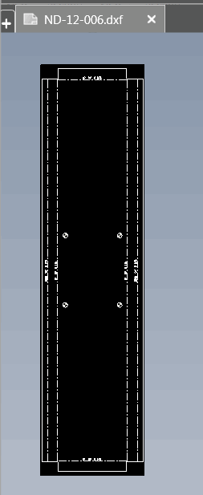

{ width=350 }

This VBA macro exports all flat pattern views from the active sheet in the drawing to the specified format (e.g. DXF or DWG) using SOLIDWORKS API. Macro exports the file to the same folder as original drawing and names files after the drawing view name.

Set **ALL_SHEETS** constant to **True** to export all sheets.

This macro can be used in conjunction with [Rename flat pattern views with cut-list names](/solidworks-api/document/drawing/rename-sheet-metal-views/) macro  if it is required to name exported files after the cut list name.

Specify the output file extension at the beginning of the macro:

~~~ vb
Const OUT_EXT As String = ".dxf"
~~~

Output name can be specified to source view name, referenced configuration name of file name via **OUT_NAME** constant.

## Algorithm

* Traverse all drawing view of the current sheet of the active drawing
* Find all drawing views of flat pattern
* Create new temp drawing and copies the view
* Remove all dimensions
* Remove all tables
* Set view and sheet scale to 1:1
* Fit sheet size to view
* Export to the specified file


