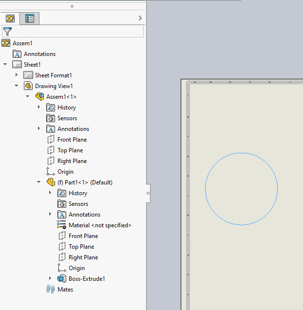
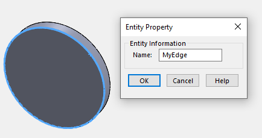

This VBA macro demonstrates how to find the specific named edge from the underlying 3D document and select it in the drawing view.

This technique can be used when developing drawing automation macros and applications.

> Note in your macro you might not use named entities, instead some different logic can be applied (e.g. finding by coordinates, color, attributes etc.). However the process of conversion the pointer to drawing view space will be the same.

This macro will work with the drawing view of the assembly where named edge is contained in the top level component as shown below:

> Refer [Get Component By Name](/solidworks-api/document/assembly/components/get-by-name/) example for the code to get component on any level if needed.

Name of the edge needs to be assigned from the corresponding part document.

