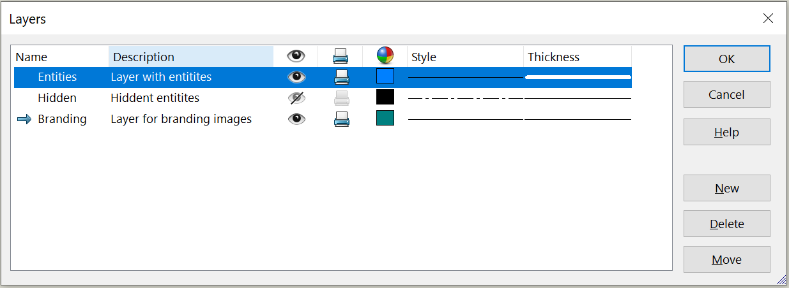

{ width=600 }

These macros allow to import and export the information from the SOLIDWORKS drawing layers into the text file.

The following information is imported and exported:

* Name
* Description
* Visibility
* Will Print
* Color
* Style
* Thickness

## Format

This macro exports all the information into the output text file in the following format

~~~
Layer: Entities
    Description: Layer with entities
    Color: 0 128 255
    Printable: True
    Style: 0
    Visible: True
    Thickness: 5

Layer: Branding
    Description: Layer for branding images
    Color: 0 128 128
    Printable: True
    Style: 0
    Visible: True
    Thickness: 0
~~~

By default file is saved or loaded in th same folder as the original file with the prefix **_Layers.txt**

## CAD+

This macro is compatible with [Toolbar+](https://cadplus.xarial.com/toolbar/) and [Batch+](https://cadplus.xarial.com/batch/) tools so the buttons can be added to toolbar and assigned with shortcut for easier access or run in the batch mode.

In order to enable [macro arguments](https://cadplus.xarial.com/toolbar/configuration/arguments/) set the **ARGS** constant to true

~~~ vb
#Const ARGS = True
~~~

Path the path to text file to import or export as a macro argument.

## Export



## Import

