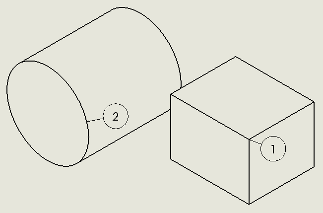

{ width=400 }

This VBA macro demonstrates how to insert balloons for all visible components of the first drawing view in the active drawing sheet using SOLIDWORKS API.

This view must already contain the BOM table linked to it. Macro will traverse all visible components and all visible entities of the view and will attach balloon linked to Item Number to the first visible entity.

