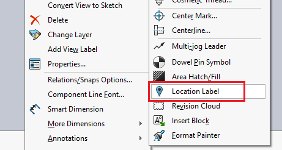

This VBA macro provides a workaround for missing SOLIDWORKS API to insert the location label to a drawing view.

Specify the name of the view as **VIEW_NAME** constant.

> Only views compatible with location label are supported, e.g. auxillary, detailed, etc.

