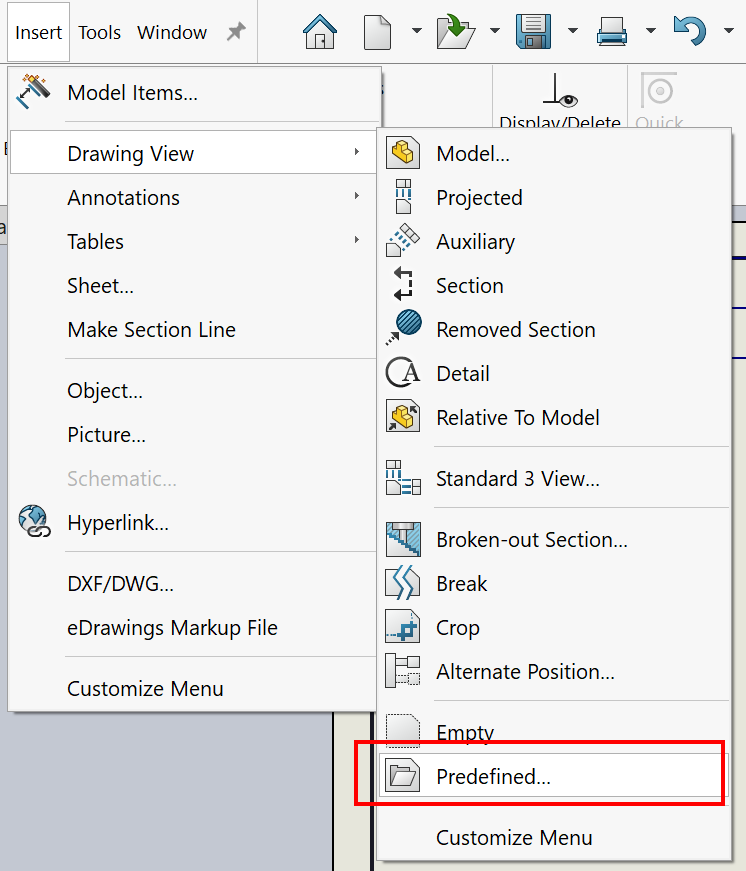

{ width = 400 }

This VBA macro allows to insert SOLIDWORKS part or assembly into the predefined views of the active drawing or drawing template

Select the predefined drawing views to insert model to. If no views are selected, all predefined views will be filled.

Macro will show the file browse dialog to select model to insert.

