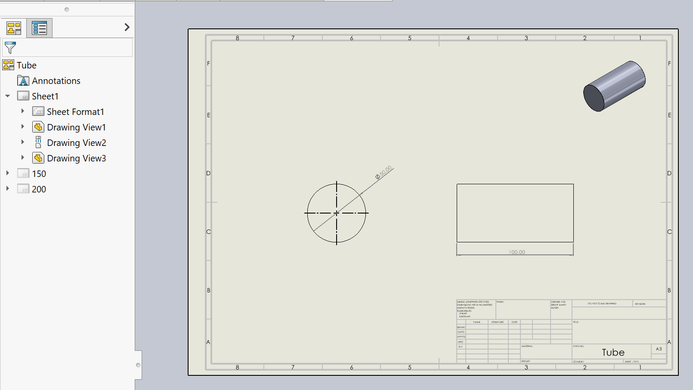

{ width=800 }

This VBA macro will copy the active sheet and propagate referenced configurations to each copy.

Macro will automatically set the referenced configuration on each new sheet and rename the sheet based on the configuration name.

As the result drawing will contain sheets for all the configurations of the multi-body part or assembly.

## Configuration

Macro can be configured by changing the constant values of the macro

~~~ vb
Const PROCESS_TOP_LEVEL_CONFIGS As Boolean = True 'True to process top level configurations
Const PROCESS_CHILDREN_CONFIGS As Boolean = False 'True to process children configurations

Const USE_CORRESPONDING_FLAT_PATTERN_CONF As Boolean = True'True to find the corresponding SM-FLAT-PATTERN configuration for the flat pattern view, False to use configuration As Is
Const GENERATE_MISSING_FLAT_PATTERN_CONF As Boolean = True 'True to automatically create new SM-FLAT-PATTERN configuration if not exist, False to use configuration As Is

Const FORCE_SINGLE_BODY As Boolean = False 'True to select single body for multi-body configurations (can be useful for the cut-list configurations)
~~~

## Notes

* Macro will skip processing system configurations (e.g. weldment As Welded and As Machined, Sheet Metal flat pattern configurations and speedpak configurations)
* Macro will not create another sheet for the same configuration which is used in the default (first) view of the sheet (template sheet)

### Sheet Metal Flat Patterns

When drawing view of the flat pattern is created from the user interface new special configuration is automatically added (SM-FLAT-PATTERN). This configuration will be set as the referenced configuration. When assigning the referenced view via SOLIDWORKS API it is possible to force assign the standard configuration to a flat pattern view and this will result in incorrect display. User will need to manually recheck the **Flat Pattern** toggle or reset the referenced configuration. **USE_CORRESPONDING_FLAT_PATTERN_CONF** option of the macro allows to find the flat pattern configuration (if exist) and use it for the flat pattern view. If not found, flat pattern view can be automatically created by setting the **GENERATE_MISSING_FLAT_PATTERN_CONF** option of the macro.

