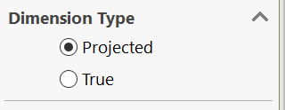

This VBA macros sets the dimension type (projected or true) for all drawing views in all sheets of the active SOLIDWORKS drawing.

Set the **DIMS_TRUE** constant to **True** to set all dimension types to **True**. Set the **DIMS_TRUE** constant to **False** to set all dimension types to **Projected**

