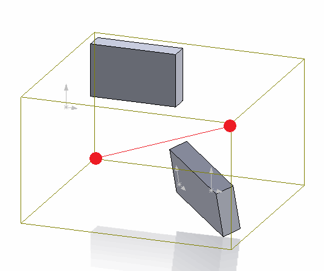
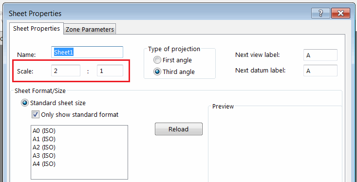
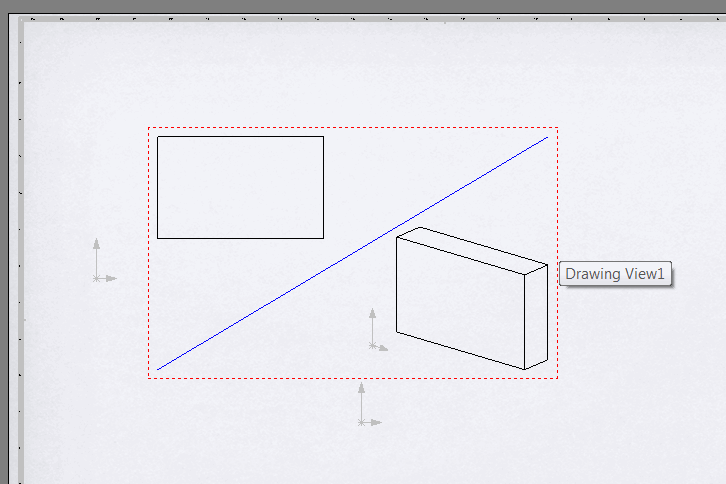

This code example demonstrates how to draw the model bounding box diagonal in the drawing view using SOLIDWORKS API.

{ width=250 }

The bounding box coordinate system is extracted from the underlying model of the drawing view. The coordinates are relative to the global coordinate system of the part or the assembly drawing view created from.

In order to properly transform the coordinate into the drawing sheet space it is required to consider the following:

* Drawing view transformation. This can be extracted using the [IView::ModelToViewTransform](https://help.solidworks.com/2018/english/api/sldworksapi/solidworks.interop.sldworks~solidworks.interop.sldworks.iview~modeltoviewtransform.html) SOLIDWORKS API method.
* Drawing sheet transformation.
* Drawing sheet scale

{ width=350 }

The combination of the above transformation will return the full transformation of the coordinate from the model space into the current sheet space.

> When inserting the sketch segments into the drawing sheet it is imported to activate the sheet space by calling the [IDrawingDoc::ActivateView](https://help.solidworks.com/2018/english/api/sldworksapi/solidworks.interop.sldworks~solidworks.interop.sldworks.idrawingdoc~activateview.html) SOLIDWORKS API method and passing an empty string as the parameter. Otherwise the entity will be inserted directly into the model space of the view document.

## Running macro

* Open drawing
* Insert view of part or assembly
* Modify view and drawing sheet scale. You can also rotate the view
* Run the macro. As the result the diagonal is drawn in the sheet space representing the bounding box of the underlying model
* Move the view. Note that the created line segment doesn't move with the view which means it was created in the drawing sheet space

{ width=300 }


