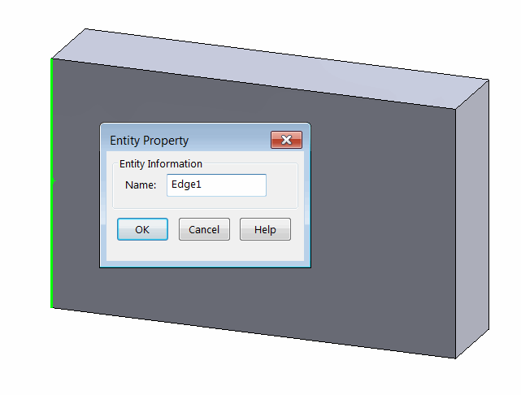
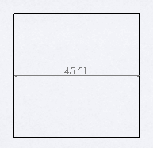

Similar to [Assembly Context](/solidworks-api/document/assembly/context/) there is drawing context. Pointer to the entity may exist in underlying model context and in the drawing view context.

When entities from the underlying model context (i.e. from part or assembly) need to be selected in the drawing view (for example for the dimensioning purposes), [IView::SelectEntity](http://help.solidworks.com/2018/english/api/sldworksapi/solidworks.interop.sldworks~solidworks.interop.sldworks.iview~selectentity.html) SOLIDWORKS API method could be called. SOLIDWORKS will automatically find the corresponding entity pointer in the drawing view and select it.

This example demonstrates how to add the linear dimension between two named edges (Edge1 and Edge2) from the underlying part model using SOLIDWORKS API. The entities can be named via the following property dialog:

{ width=350 }

As the result the dimension is added between the edges.

{ width=250 }

Location of the dimension is found as a middle point of the line drawn between two middle points of the dimensioned edges. Unlike [drawing in sheet context](/solidworks-api/document/drawing/sheet-context-sketch/), drawing sheet scale is not required to be multiplied to the view transformation matrix when positioning the dimensions.



