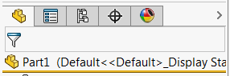

This example demonstrates how to activate standard tabs (feature manager tree, property manager, configuration manager, DimXpert manager, display manager) in the feature manager view using SOLIDWORKS API.

* Specify the tab to activate using the *FeatMgrTab_e* enumeration
* Run the macro (VSTA3)
* Active tab is shown in the message box
* Specified tab is activated

**ModelDocExtension.cs**


**SolidWorksMacro.cs**

