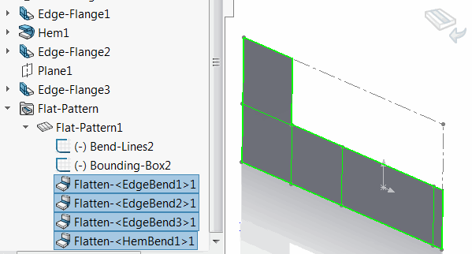
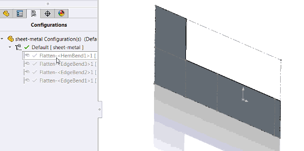

This macro create new configurations for all features selected in the feature tree and suppresses them one by one in the respective configuration using SOLIDWORKS API.

This macro can be useful if it is needed to represents some historical data of the model in the configurations.

## Notes

* Configurations created as derived configurations of the active configuration
* Each configuration named after the feature name
* Features are processed in the order they have been selected
* Each feature and all previous features will be suppressed in the respective configuration

## Use cases

### Sheet Metal Bending

This macro can be used to represent the steps of bending of the sheet metal. In this case each configuration will represent the bending step.

* Set the sheet metal part to the flattened state
* Select flatten bends in the order under the *Flat-Pattern* feature

{ width=350 }

* Run the macro

As the result sub configurations for each bend are created representing the bending step:

Refer the [Animate Configurations](solidworks-api/motion-study/animate-configurations/) for example macro to animate the configurations using SOLIDWORKS API.


