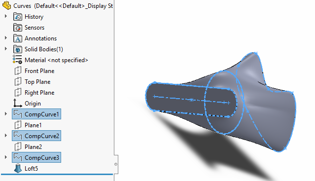

{ width=400 }

This VBA macro demonstrates how to utilize [IFeatureManager::InsertProtrusionBlend2](https://help.solidworks.com/2018/english/api/sldworksapi/SOLIDWORKS.Interop.sldworks~SOLIDWORKS.Interop.sldworks.IFeatureManager~InsertProtrusionBlend2.html) API to create loft feature from the selected sketches or curves features selected in the Feature Manager Tree.


