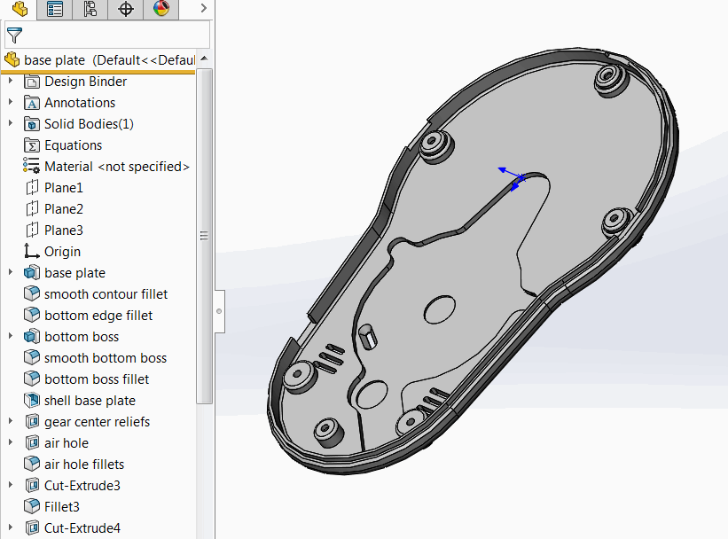
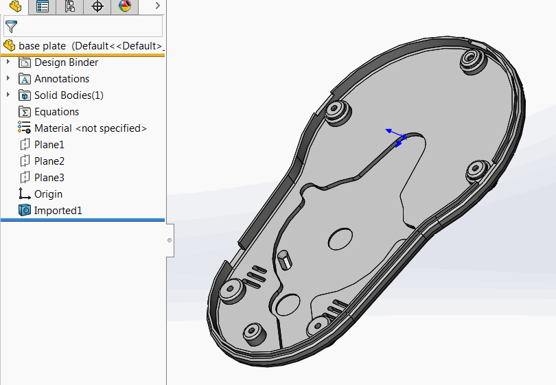

This macro emulates the functionality of [Defeature for Part](http://help.solidworks.com/2018/english/solidworks/sldworks/c_defeature_for_parts.htm) but not using it directly.

Macro copies all visible solid and surface bodies, deletes all user features and imports the copied bodies using SOLIDWORKS API.

**Before:**

{ width=350 }

**After:**
{ width=350 }


