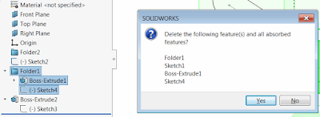

When deleting the top folder in SOLIDWORKS features tree all sub features are not get deleted so it is required to select all of them one-by-one in order to delete folder content.

This is not always possible to do in one step due to the features relations:  

{ width=400 }

The macro below allows to delete all of the features in the selected folder in one click using SOLIDWORKS API. Nested folders are also supported.

{ width=400 }

Macro can optionally display the confirmation dialog with the list of features about to be deleted


