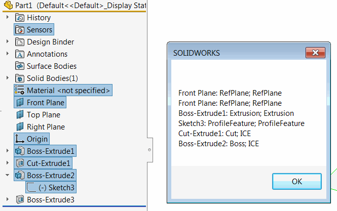
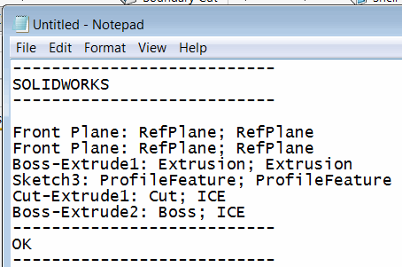

This VBA macro reads the type names of the selected features in the feature manager tree using SOLIDWORKS API and displays the result in the message box in the following format:

~~~
<Feature Name>: <Type Name 1>, <Type Name 2>
~~~

{ width=350 }

Where *Type Name 1* is an older version of feature type name retrieved via [IFeature::GetTypeName](http://help.solidworks.com/2016/english/api/sldworksapi/solidworks.interop.sldworks~solidworks.interop.sldworks.ifeature~gettypename.html) SOLIDWORKS API method, while *Type Name 2* is a newer version retrieved via [IFeature::GetTypeName2](http://help.solidworks.com/2016/english/api/sldworksapi/solidworks.interop.sldworks~solidworks.interop.sldworks.ifeature~gettypename2.html)

*Type Name 2* will be equal to *ICE* for the boss-extrude and cut-extrude features created using the Instant3D functionality. Use the value of *Type Name 1* to get the specific feature type name.

If it is required to copy the result into the text format, simply click on message box and press *Ctrl+C* to copy the value and paste it into any text editor, like Notepad via *Ctrl+V*:

{ width=250 }


