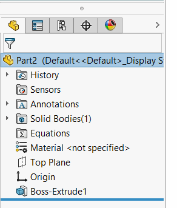

This VBA macro allows to make invisible selected features in the tree. The features still continue to be fully operational and visible in the graphics area (e.g. planes), but not visible in the feature manager tree.

Even default features (such as planes) can be made invisible.

To show the hidden features use the [Reveal Hidden Features](/solidworks-api/document/features-manager/reveal-hidden-features/) macro.


