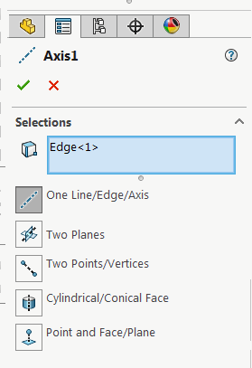

{ width=250 }

This VBA example demonstrates how to modify the definition and change the selection for the axis feature using SOLIDWORKS API.

* Select the target axis feature to modify as first selection
* Select the objects to be set as the reference for the target axis. For example 2 intersecting planes, edge, etc.

As the result the selected objects (second to the last) will be assigned to the axis (first selection).


