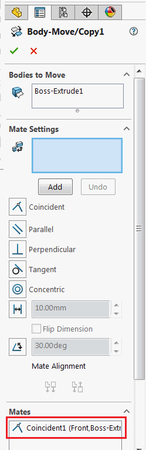

{ width=150 }

C# VSTA macro example which finds the largest planar face of the selected body and inserts move-copy body feature in part and adds coincident mate with Front Plane using SOLIDWORKS API.

* Open part document
* Select any body which contains the planar face
* Run the macro. As the result move-copy body feature is inserted via [IFeatureManager::InsertMoveCopyBody2](http://help.solidworks.com/2016/english/api/sldworksapi/solidworks.interop.sldworks~solidworks.interop.sldworks.ifeaturemanager~insertmovecopybody2.html) SOLIDWORKS API method. Then coincident mate is added between the largest face of the body and front plane using [IMoveCopyBodyFeatureData::AddMate](http://help.solidworks.com/2016/english/api/sldworksapi/SolidWorks.Interop.sldworks~SolidWorks.Interop.sldworks.IMoveCopyBodyFeatureData~AddMate.html) SOLIDWORKS API method.


