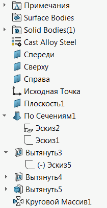
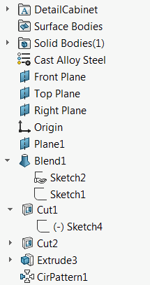

This VBA macro allows to rename the feature manager tree in the part document using SOLIDWORKS API based on specified rules and feature type names.

This macro can be used as a translator macro to rename feature tree form one language to another.

For example this feature tree is in Russian language:

{ width=350 }

It can be renamed to English language equivalent:

{ width=350 }

## Configuration

Macro is using the data specified in 2 files which must be stored in the same folder as the macro:

~~~ vb
Const NO_INCREMENT_FILE As String = "noincrement.csv"
Const CUSTOM_MAP_FILE As String = "custommap.csv"
~~~

These files can be edited in Excel or any text editor (like Notepad).

### No Increment CSV File

This file contains the feature type names whose names should not be increment (i.e. they present once in a tree), for example *Origin* feature or *Documents Folder*.

This is a single column CSV file. [Download](noincrement.csv)

### Custom Map CSV File

This file contains the special names for the feature types. By default the feature will be named after its type, but this behavior can be overridden in this file. For example type name for the *Sketch* feature is *OriginProfileFeature*, so by default all sketches will be renamed to *OriginProfileFeature1*, *OriginProfileFeature2*, *OriginProfileFeature3* etc., unless the following line is added to *custommap.csv* file

~~~
OriginProfileFeature,Sketch
~~~

In this case the sketches will be renamed to *Sketch1*, *Sketch2*, *Sketch3*

This is a 2 column CSV file

[Download](custommap.csv)

## Feature Types

Feature types are language independent identifers of feature kind. Use [Get Features Type Name](/solidworks-api/document/features-manager/get-feature-type-name/) VBA macro to extract type names. Use *Type Name 2* unless it is equal to *ICE* (in this case use *Type Name 1*)

### Special Feature Types

There are several special types of feature which can be used for renaming

* _FrontPlane
* _RightPlane
* _TopPlane


