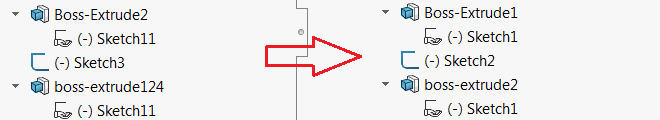

This macro renames all the features in active model in the sequential order using SOLIDWORKS API, preserving the base names .

Only indices are renamed and the base name is preserved. For example *Sketch21* will be renamed to *Sketch1* for the first appearance of the sketch feature.

## Filter

Macro can be configured to only process features that match the specific type pattern. Use [Get Feature Type Name](/solidworks-api/document/features-manager/get-feature-type-name/) macro to identify feature type.

Fill the **FEATS_FILTER** with the type names. Wildcard is supported

~~~ vb jagged
Dim FEATS_FILTER As Variant

Sub main()

    FEATS_FILTER = Array("Mate*", "MirrorCompFeat") 'only process mates and Mirror Component features 

    Set swApp = Application.SldWorks
~~~

## Notes

* Only features with number at the end will be renamed (e.g. *Front Plane* will not be renamed to *Front Plane1* and *My1Feature* will not be renamed)
* Case is ignored (case insensitive search)
* Only modelling features are renamed (the ones created after the Origin feature)
* In the assembly documents, only assembly feature are renamed (components are ignored)
* If components are selected in the assembly, features of those components will be renamed

Watch [video demonstration](https://youtu.be/jsjN8zNRTuc?t=139)


