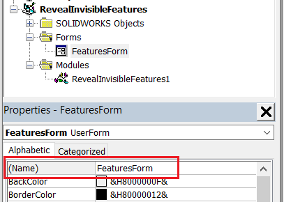
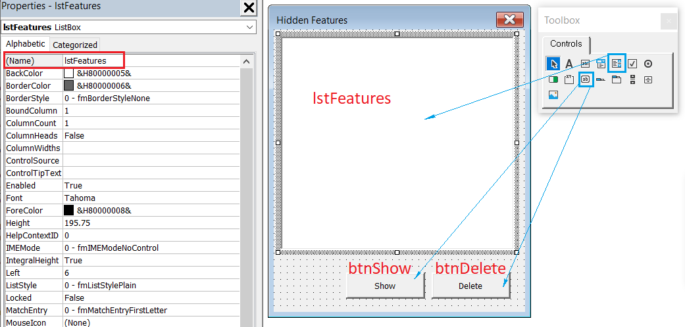
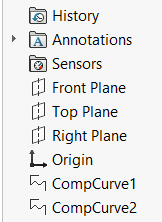

{ width=250 }

This VBA macro helps to reveal all features in the active SOLIDWORKS model which are hidden in the feature manager tree.

There are may be various reasons for the features to be hidden in the SOLIDWORKS files. In some cases those feature are invalid or dangling. This could cause unpredicted behavior of SOLIDWORKS, including performance problems or instability such as crashes or hanging.

* Create a new macro and paste the [module code](#macro-module) into the macro
* Add new [user form](/visual-basic/user-forms/) into the macro and name it *FeaturesForm* and paste the [code](#featuresform-user-form). The macro structure should look similar to the image below

* Add controls to the form and name according the to image below. Optionally specify more attributes to controls such as caption.

    * List Box named *lstFeatures*
    * Button named *btnShow*
    * Button named *btnDelete*

As the result of running the macro all hidden features will be populated in the list. Select (or multi select) features in the list and click *Show* or *Delete* button to either show or remove features from the model.

> !IMPORTANT: use delete option on your own risk. In some cases the hidden feature is a valid feature created by SOLIDWORKS or 3rd party applications. For example [attributes](/solidworks-api/data-storage/attributes/) can be created as a hidden features and can contain important information. Removing this can have unexpected results.

To hide the feature use the [following macro](/solidworks-api/document/features-manager/hide-features/) macro.

## Macro Module



## FeaturesForm User Form


