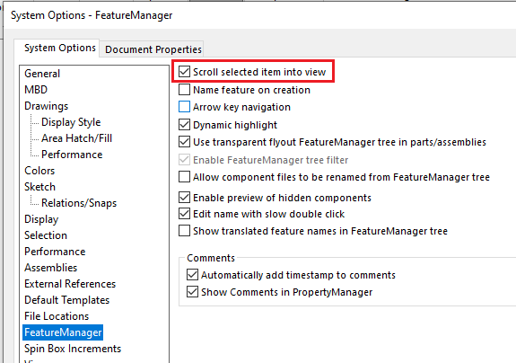
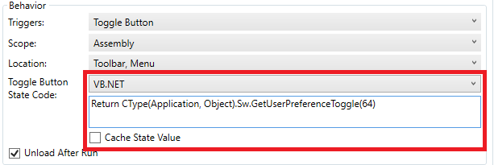

This VBA macro allows to toggle on and off the 'Scroll selected item into view' option in FeatureManager section of SOLIDWORKS settings. This provides performance benefits when working with models with large feature tree (e.g. Large Assembly Documents). Turning off this option will significantly improve the speed of selecting items in the graphics area as Feature Tree does not need to be scrolled into the view.

## Using macro in Toolbar+

This macro can be used in [Toolbar+](https://cadplus.xarial.com/toolbar/) which will improve the user experience. It is possible to enable the [toggle state](https://cadplus.xarial.com/toolbar/configuration/toggles/) for the macro button.

Paste this code into the "Toggle Button State Code" text box:

~~~ vb
Return CType(Application, Object).Sw.GetUserPreferenceToggle(64)
~~~

