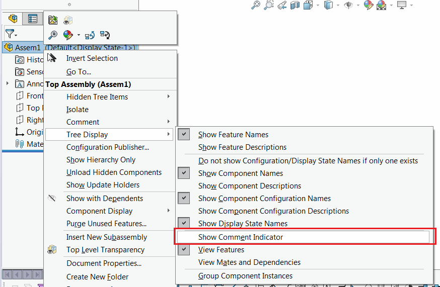

{ width=350 }

This VBA macro uses the combination of SOLIDWORKS API and Windows API to toggle the 'Show Comment Indicator' option in Feature Manager tree which is currently not available in SOLIDWORKS API.


