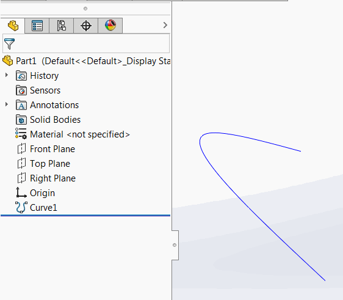
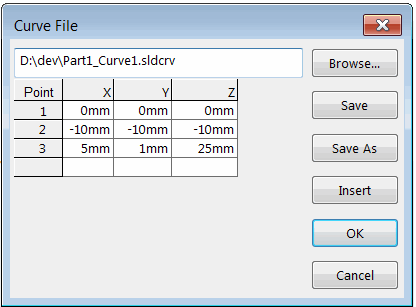

{ width=450 }

SOLIDWORKS allows to insert the free form curve through XYZ coordinates from the external text file. This file however is not linked to the feature itself and the curve is not updated when external file changes.

{ width=300 }

This VBA macro allow to automatically link the external file with coordinates and update the selected curve with single click.

Example of curve file:

~~~
0mm 0mm 0mm
10mm 10mm 10mm
5mm 1mm 25mm
~~~

Curve text file must be saved in the same folder where the SOLIDWORKS file is saved and must be named as [Model Title]_[Feature Name].sldcrv. For example if curve feature is named *Curve1* and resides in the SOLIDWORKS file named Part1.sldprt, the curve text file must be named *Part1_Curve1.sldcrv*.


