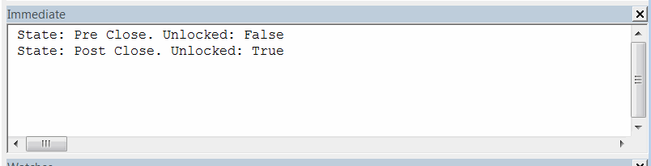
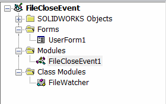

File closing (destroy) notification (such as [DestroyNotify2](http://help.solidworks.com/2017/english/api/sldworksapi/SOLIDWORKS.Interop.sldworks~SOLIDWORKS.Interop.sldworks.DAssemblyDocEvents_DestroyNotify2EventHandler.html)) for parts, assemblies and drawings are raised when the file is about to be closed (pre notification), which means that file is still not released from memory.

This could be a blocker for the applications such as Product Data Management (PDM) where closing of the file should unlock it as some additional operation might need to be performed (e.g. removing the file from the local cache, moving to the archive, post processing the stream, clearing resources).

This example demonstrates how to handle both pre and post notifications using SOLIDWORKS API.

* Open any SOLIDWORKS file
* Run the macro from the main method in the macro module. Temp form is displayed
* Close SOLIDWORKS file
* See the output in the Immediate window of VBA. There are 2 lines printed:
    * First - when the file is about to be closed
    * Second - when file is fully closed

At both handlers macro checks if the file is unlocked (i.e. released from the memory). As the result in first handler - file is locked and it is unlocked in the second handler, as expected.

**NOTE: IsFileUnlocked function is opening the stream for read-write and it can potentially corrupt the file. It is strongly recommended to use this macro on sample model only**

To create a macro add 2 more modules into your VBA Editor:

* Class Module named *FileWatcher* 
* User Form named *UserForm1*

{ width=250 }

Paste the codes into the corresponding modules as follows:

**FileWatcher Class Module**


**UserForm1 Form**


**Macro Module**

