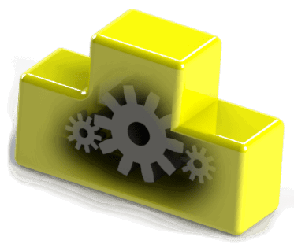

{ width=200 }

SOLIDWORKS documents (parts, assemblies and drawings) provide large amount of API functions for automation.

There are common functionalities which are available for all types of documents and usually accessible via [IModelDoc2](http://help.solidworks.com/2012/English/api/sldworksapi/SOLIDWORKS.Interop.sldworks~SOLIDWORKS.Interop.sldworks.IModelDoc2.html) or [IModelDocExtension](http://help.solidworks.com/2012/english/api/sldworksapi/SOLIDWORKS.Interop.sldworks~SOLIDWORKS.Interop.sldworks.IModelDocExtension.html) SOLIDWORKS API interfaces.

This includes but not limited to:

* Annotations
* Sketch
* Feature Manager

There are also specific functionalities available only for the specific types of documents

* Parts APIs are available via [IPartDoc](http://help.solidworks.com/2012/english/api/sldworksapi/solidworks.interop.sldworks~solidworks.interop.sldworks.ipartdoc.html) interface
* Assemblies APIs are available via [IAssemblyDoc](http://help.solidworks.com/2012/english/api/sldworksapi/solidworks.interop.sldworks~solidworks.interop.sldworks.iassemblydoc.html) interface
* Drawings APIs are available via [IDrawingDoc](http://help.solidworks.com/2012/english/api/sldworksapi/solidworks.interop.sldworks~solidworks.interop.sldworks.idrawingdoc.html) interface

Specific interface can be cast to the generic interface and vice verse.

IModelDocExtension can be accessed via [IModelDoc2::Extension](http://help.solidworks.com/2012/english/api/sldworksapi/solidworks.interop.sldworks~solidworks.interop.sldworks.imodeldoc2~extension.html) property.
