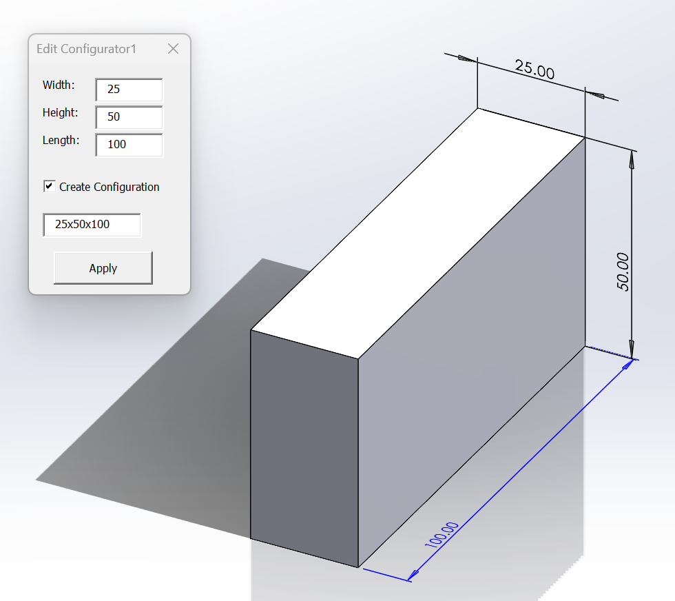
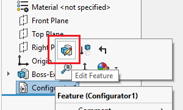
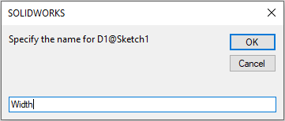
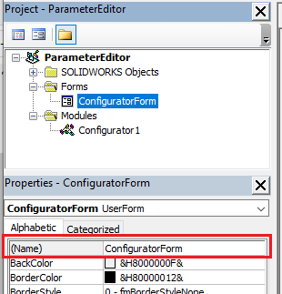

This VBA macro leverages functionality of macro feature to create custom model configurator for the specified dimensions.



Macro will build dynamic User Interface for the specified dimension and insert the **Configurator** feature directly in the Feature Manager tree.

Design can be modified at any time by clicking **Edit Feature** command

To insert the feature, pre-select dimensions you want to be configured and run the macro.

For each selected dimension specify the user friendly title (this will be displayed on the form):

Once inserted. Edit the definition of the feature to update the model.

## Configuration

User can modify the constants below to change some of the parameters.

* **BASE_NAME** constants defines the default name used for the configurator feature
* **EMBED_MACRO_FEATURE** allows to embed the code directly to the model, so it is no longer linked to the original macro. This model can be shared with anyone and edited without the need to supply the original macro

~~~ vb
Public Const BASE_NAME As String = "MyConfigurator" 'default name for the feature

Const EMBED_MACRO_FEATURE As Boolean = True' embeds macro feature into the model
~~~

## Macro Setup

* Create new macro and copy the code below:



Add new [User Form](/visual-basic/user-forms/) and place the code below into the form's code behind



Specify the name for the form to be **ConfiguratorForm**. As the result the solution tree in VBA will look like below:

