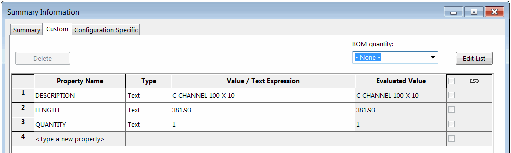
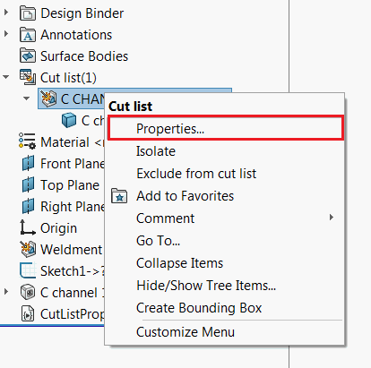
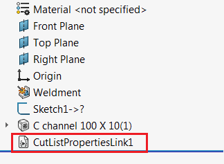

{ width=450 }

This VBA macro inserts the macro feature using SOLIDWORKS API into the part file which allows to dynamically link specified cut-list custom properties to the file generic custom properties.

{ width=250 }

Macro feature rebuilds automatically when the parent weldment feature (e.g. structural member feature) is changed. Regeneration method is handling the post update notification which allows to read the up-to-date values of cut-list custom properties.

> Reading the custom properties directly from the swmRebuild function will not return the up-to-date values as at the moment of the regeneration all the properties are not evaluated yet.

Macro feature is inserted into the feature tree and can be suppressed or removed.

One of the benefits of this approach comparing to linking the properties directly with the equation is that it is not name dependent, i.e. properties will remain linked even if cut-list renamed (for example when structural member profile is changed).

{ width=250 }

## Instructions

* Create new macro and copy the code below



* Add new class module to the macro and name it *PostRegenerateListener*. Place the code below into the class module



* Configure the properties which needs to be linked in the *Class_Initialize* function in *PostRegenerateListener*

~~~ vb
Private Sub Class_Initialize()
    LinkedProperties = Array("DESCRIPTION", "LENGTH", "QUANTITY", "Another Property", "...")
End Sub
~~~

* Select the weldment feature (e.g. structural member) and run the macro. Macro feature is inserted and embedded into the model. You can close and reopen model and SOLIDWORKS session - feature will automatically rebuild. Model can be shared with other users and the behavior will be preserved.
