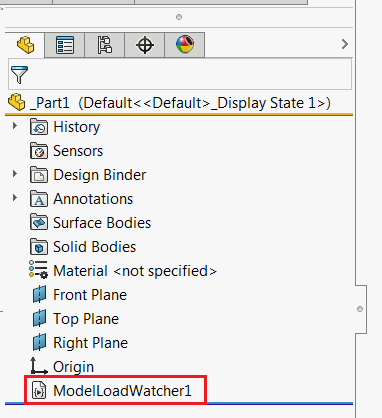



This VBA macro inserts the macro feature into the model using SOLIDWORKS API and allows to run custom code every time the model with this feature is loaded.

This can be useful when certain code needs to be run on every model load (e.g. update custom properties, log information, etc.)

Feature is visible in the tree and can be embedded into the document template if required.

{ width=250 }

## Configuration

* Create new macro
* Copy the code into corresponding modules of the macro
* To configure the macro modify the options defined in the constants:

    * EMBED_MACRO_FEATURE - true to embed this macro directly into the document. With this option model can be shared and will work on each computer (macro doesn't meed to be shared). Refer the [Macro Based Macro Feature](/solidworks-api/document/macro-feature/#macro-based-macro-feature) section for benefits and limitation of this approach.
    * BASE_NAME - default naming convention for the feature

~~~ vb
Const EMBED_MACRO_FEATURE As Boolean = True
Const BASE_NAME As String = "MyFeatureName"
~~~

* Place your code into the *main* sub of the *HandlerModule* module. The pointer to [IModelDoc2](http://help.solidworks.com/2012/english/api/sldworksapi/SolidWorks.Interop.sldworks~SolidWorks.Interop.sldworks.IModelDoc2.html) document is passed as the parameter. Use this pointer instead of [ISldWorks::ActiveDoc](http://help.solidworks.com/2012/english/api/sldworksapi/solidworks.interop.sldworks~solidworks.interop.sldworks.isldworks~activedoc.html) SOLIDWORKS API property as this method is called for invisible documents (i.e. loaded as assembly or drawing components).

~~~ vb
Sub main(model As SldWorks.ModelDoc2)
    'TODO: add your routine here
End Sub
~~~

## Macro Module

Main macro routine to insert feature and define event handles



## HandlerModule Module

Module to insert required code to be run every time model loads. Must be named *HandlerModule*


