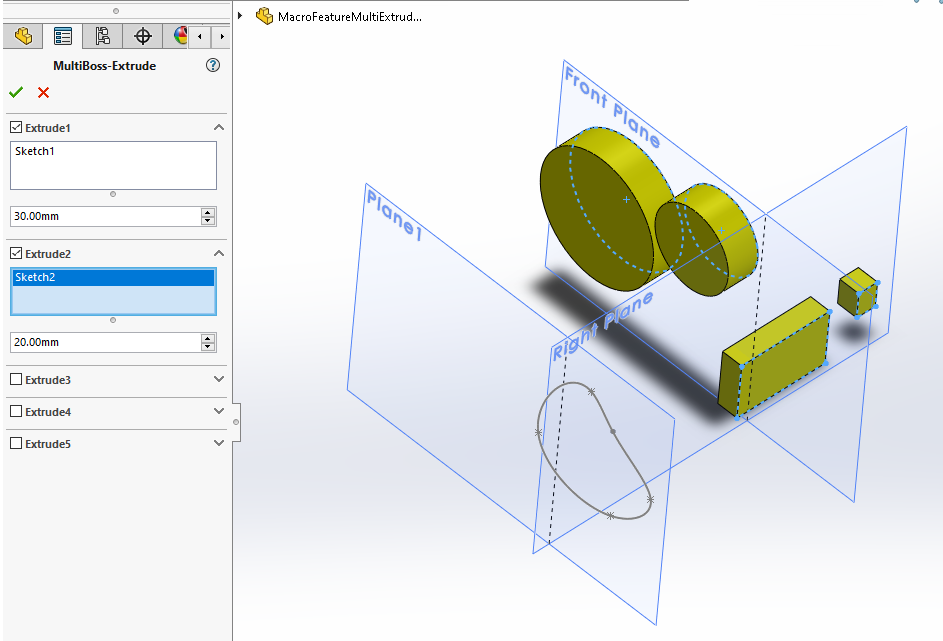
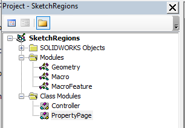

 { width=500 }

This VBA macro demonstrates how to create parametric SOLIDWORKS macro feature to create single extrude from multiple sketches using VBA.

Watch video below which demonstrates the macro and explains how macro was built and how it works.



Create the following macro structure and copy the code snippets to the corresponding modules and classes.

## Macro Module

Entry point of the macro. Use this to insert new macro feature.



## Geometry Module

Module contains helper functions for building temp geometry of extrudes from input sketches



## MacroFeature Module

Implements the behavior of macro feature: regeneration and editing



## PropertyPage Class Module

Implements the property manager page interface for the macro feature.



## Controller Class Module

Connects the property manager page inputs to corresponding functionality (i.e. Edit or Insert)



[Download sample model](MacroFeatureMultiExtrude.SLDPRT)