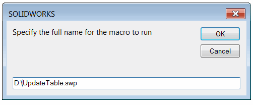
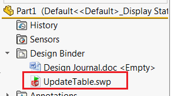
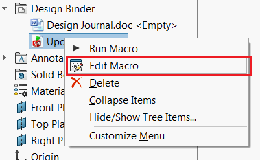

This macro allows to automatically run specified macro with every rebuild operation using SOLIDWORKS API.

To setup the macro:

* Run the macro
* Specify the full path to the macro to run
{ width=250 }

This macro will be added to the model as a design binder attachment
{ width=250 }
* Macro feature is inserted to the macro as the last feature in the tree.

When model is rebuilt (either on demand or automatically) macro will be automatically run.

By default macro feature and a macro are embedded into the model. That means that the model can be opened and will be updated on any other workstation which doesn't have this macro available.

This can be also embedded directly to the document template.

### Options
Macro feature name can be changed via constant

~~~ vb
Const BASE_NAME As String = "[Name of Feature]"
~~~

By default the macro is embedded into the model. In order to edit the macro code use the *Edit* command in the design binder attachment

{ width=250 }

In order to avoid embedding of the macro change the following constant to *False*

~~~ vb
Const EMBED_MACRO As Boolean = False
~~~


