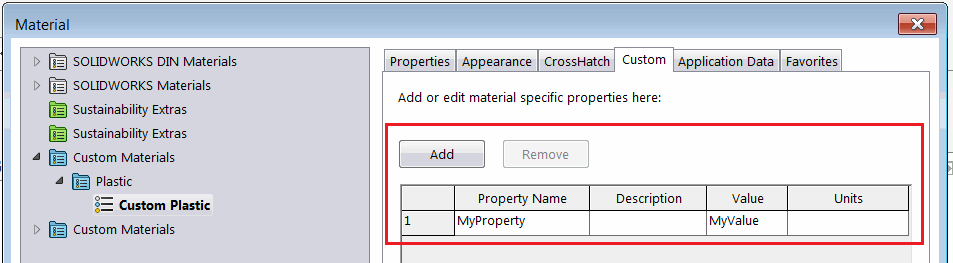

{ width=450 }

This macro demonstrates how to copy the specified custom property from the material database to the model custom property using SOLIDWORKS API and XML parsers.

*MSXML2.DOMDocument* object is used to read XML of the material database and select the required material node.

* Specify the custom property name to copy via *PRP_NAME* variable

~~~ vb
Const PRP_NAME As String = "MyProperty"
~~~

* Run the macro. Macro will find the material of active part and read the property value from the material database file
* Macro will create/update the generic custom property of the file to the corresponding value of the custom property from material


