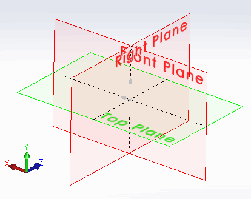

{ width=250 }

This example demonstrates how to compare two model views in part or assembly using SOLIDWORKS API.

Macro will identify the changes and display the result if

* Views are the same
* Views are of different orientation (i.e. rotated)
* Views are of different translation (i.e. moved)
* Views are of different scale

Macro is using [user defined type](visual-basic/data-structures/types/) **ViewData** to store the orientation, translation and scale of the view. This structure is not linked to the view and represents the snapshot of view transformation.

Result of the **CompareViewData** function is defined as *CompareViewResult_e* [flag enumerator](visual-basic/data-structures/enumerators#flag-enumerator-multiple-options). This allows to return specific change in the view orientation or combination of changes.

* Open the model and start the macro.
* Macro will pause the execution once the data from the first view is read.
* Change the view and continue the execution of the macro.
* Result is displayed in the message box.


