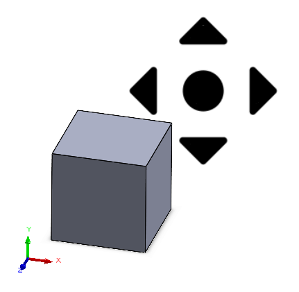

{ width=350 }

This example demonstrates how to move the view (pan) by specifying the offset in X and Y coordinates of the screen (pixels). Macro transforms the offset into the model view 3D space and updates the view positions.


