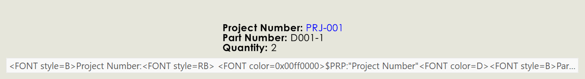

{ width=800 }

This VBA macro copies the value of formatted text from the selected note in SOLIDWORKS part, assembly or drawing and copies the value to the clipboard.

Formatted note text includes font information (size, style, color), align, paragraph properties, etc.

{ width=800 }

