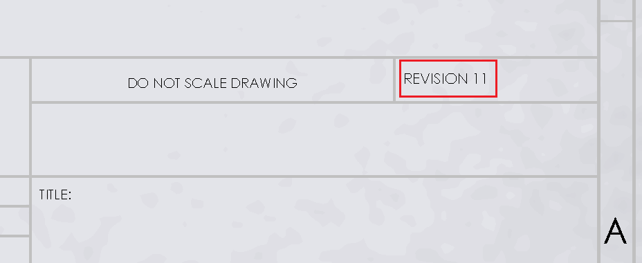
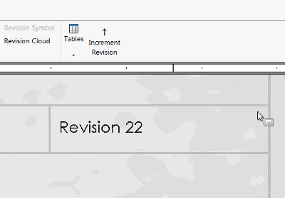

{ width=300 }

This macro increments the numeric value of the notes using SOLIDWORKS API. This can be useful if it required to increment the revision for note or notes without the need of manually selecting and changing the note. This macro can be also used in the batch processing software.

* Numeric value is matched by specified [regular expression](https://en.wikipedia.org/wiki/Regular_expression). It is possible to modify the regular expression to match specific numeric values. Note can contain free text (in this case only numeric part will be updated as per specified regular expression)
* It is required to add the text tag to the note in order to increment its value. Follow [Add Tag To Selected Note]({{ "solidworks-api/document/notes/tag-selected-note" | relative_url}}) example of instructions for adding the tag to the note.
* By default the numeric value is incremented by 1, but this can be changed by modifying the value of *increment* parameter of the *IncrementNoteValue* function.


