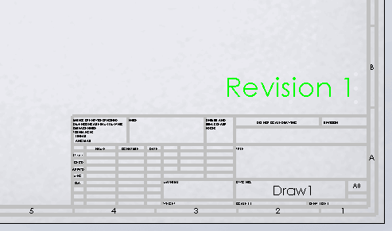

{ width=300 }

This example demonstrates how to add text tag (attribute) to the selected note in SOLIDWORKS model (part, assembly or drawing) using SOLIDWORKS API.

Specify the name of the tag as the *TAG* constant in the macro.

* The tag allows to track the specific note across the model sessions. This can be useful if macro needs to update the note (e.g. change the revision or linked value)
* Tag is preserved if note changes its text or formatting
* Tag is preserved if note moves (including moving from sheet space to sheet format)
* Tag is not visible/changeable from the User Interface (it can only be accessed via SOLIDWORKS API)


