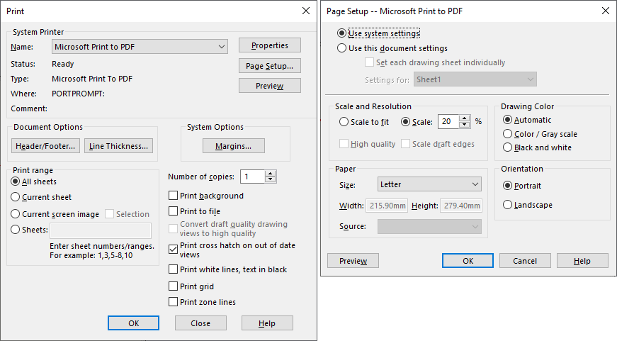

{ width=500 }

This VBA macro allows to print active SOLIDWORKS document. It is possible to specify the settings for printing: printer name, printer range, orientation, paper size and scale

## Settings

To configure settings change the values of constants at the top of the macro as described below

~~~ vb
Const PRINTER_NAME As String = "Microsoft Print To PDF" 'full name of the printer
Const PRINT_RANGE As String = "1-3,5" 'range to print. Specify * to print all pages or a range
Const PRINT_ORIENTATION As Integer = swPageSetupOrientation_e.swPageSetupOrient_Landscape 'orientation landscape or portrait
Const PRINTER_PAPER_SIZE As String = "A3" 'Paper size to print to
Const PRINT_SCALE As String = "*" 'Scale of print. Use * to scale to fit or a value of scale % (from 1 to 1000)
~~~

