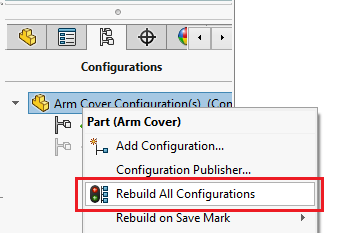
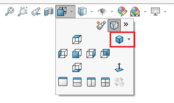
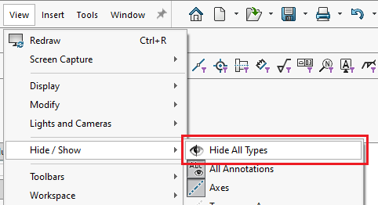
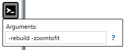

This VBA macro allows to perform operations usually required to upgrade the model to new version of SOLIDWORKS. It allows to:

* Force rebuild the model (ctrl+Q)

* Set model to isometric orientation

* Hide all view types

Configure the macro actions by setting the values of corresponding constants

~~~ vb
Const DEFAULT_VIEWZOOMTOFIT As Boolean = True
Const DEFAULT_REBUILD As Boolean = True
Const DEFAULT_HIDE_ALL_TYPES As Boolean = True
~~~

This macro also supports [macro arguments](https://cadplus.xarial.com/macro-arguments/): **-zoomtofit**, **-rebuild**, **-hidealltypes**


