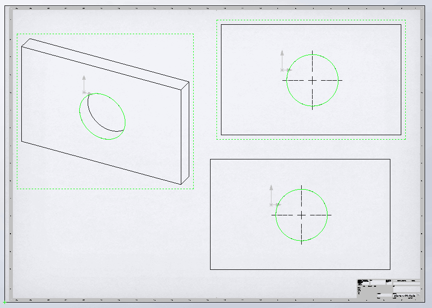
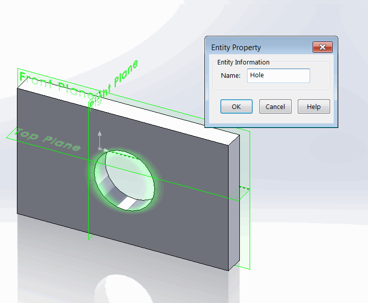

{ width=300 }

This example demonstrates different approaches of selecting entities (e.g. edge, face, vertex) in the drawing views using SOLIDWORKS API

1. Selecting entity in the target view via direct [IView:SelectEntity](http://help.solidworks.com/2012/english/api/sldworksapi/SolidWorks.Interop.sldworks~SolidWorks.Interop.sldworks.IView~SelectEntity.html) method. This method is useful when it is required to select entity without the need of passing any additional data (such as selection mark or callout).
1. Selecting entity by specifying the view in the selection data via [ISelectData::View](http://help.solidworks.com/2012/english/api/sldworksapi/SolidWorks.Interop.sldworks~SolidWorks.Interop.sldworks.ISelectData~View.html) SOLIDWORKS API property. This enables more flexibility compared to previous method as it is possible to provide more selection information.
1. Selecting visual entities. This approach allows to find the entity in the context of the drawing view. The main benefit as it would only attempt to select the entity which is visible in the current view orientation while previous two approaches do not consider the case where entity is hidden behind other entities.

* To run the macro download the [sample model and the drawing](plate-with-hole.zip).
* Circular edge was named *Hole* in the part document

{ width=300 }

* Run the macro and this edge is selected in all 3 views with 3 different approaches described above.


