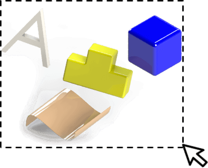
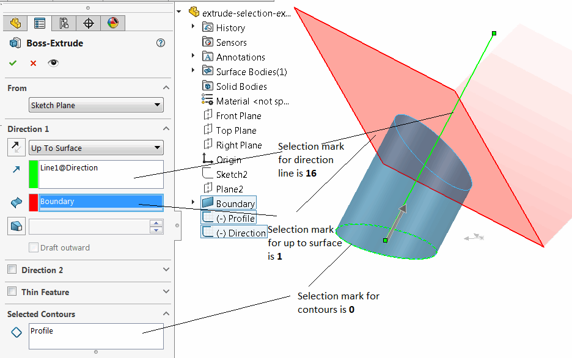
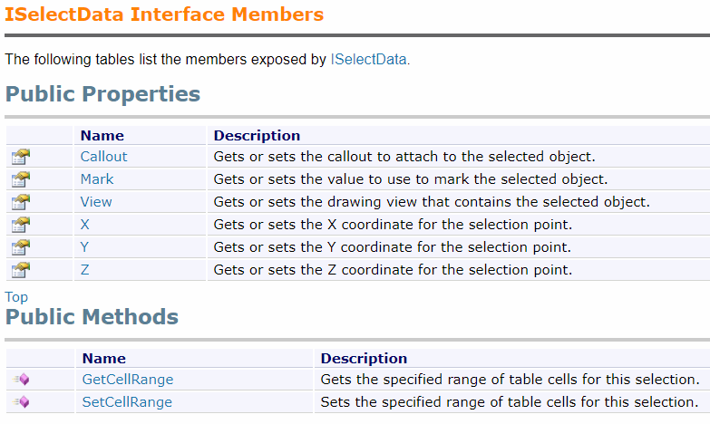
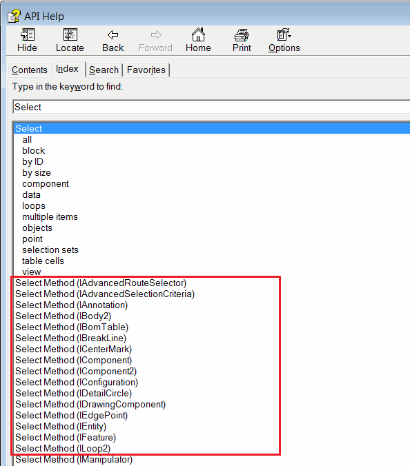

{ width=300 }

Selection is a vital part of SOLIDWORKS API development process. In this article different selection methods and selection options will be discussed.

### Application

Mainly selections are used for

* [Features creation](/solidworks-api/document/features-manager) (e.g. Extrude feature requires selection of the sketch and optional selection of direction)
* [Mating](/solidworks-api/document/assembly/mates)
* Evaluation (i.e. surface area or perimeter calculation)
* [Dimensioning](/solidworks-api/document/dimensions)
* Highlighting

### Selection Marks

{ width=500 }

Selection marks are integer attributes which can be associated with the selected entity in order to differentiate different group of objects by purpose. For example selection used in different selection boxes in the property manager page will have different selection marks. Selection marks can be assigned while selection of new objects via [IModelDocExtension::SelectByID2](https://help.solidworks.com/2012/english/api/sldworksapi/solidworks.interop.sldworks~solidworks.interop.sldworks.imodeldocextension~selectbyid2.html) method, or direct *Select* methods such as [IFeature::Select2](https://help.solidworks.com/2012/english/api/sldworksapi/solidworks.interop.sldworks~solidworks.interop.sldworks.ifeature~select2.html) where the mark is passed as an *Mark* parameter.

Selection mark can also be passed within the [Selection Data](#selection-data) [ISelectData::Mark](https://help.solidworks.com/2016/english/api/sldworksapi/SolidWorks.Interop.sldworks~SolidWorks.Interop.sldworks.ISelectData~Mark.html) property as some select methods expect this object to be passed to the method as *Data* parameter (e.g. [IComponent2::Select4](https://help.solidworks.com/2012/english/api/sldworksapi/SOLIDWORKS.Interop.sldworks~SOLIDWORKS.Interop.sldworks.IComponent2~Select4.html), [IAnnotation::Select3](https://help.solidworks.com/2012/english/api/sldworksapi/SolidWorks.Interop.sldworks~SolidWorks.Interop.sldworks.IAnnotation~Select3.html) methods).

Use [ISelectionMgr::SetSelectedObjectMark](https://help.solidworks.com/2012/english/api/sldworksapi/SolidWorks.Interop.sldworks~SolidWorks.Interop.sldworks.ISelectionMgr~SetSelectedObjectMark.html) method to change the selection mark of already selected object.

### Selection Data

Selection data is an object created via [ISelectionMgr::CreateSelectData](https://help.solidworks.com/2012/english/api/sldworksapi/solidworks.interop.sldworks~solidworks.interop.sldworks.iselectionmgr~createselectdata.html) SOLIDWORKS API method which can be passed to various selection methods (e.g. [IBody2::Select2](https://help.solidworks.com/2012/english/api/sldworksapi/SOLIDWORKS.Interop.sldworks~SOLIDWORKS.Interop.sldworks.IBody2~Select2.html)).

Selection data allows to provide additional instruction to the selection:

* [Associate callouts](/solidworks-api/adornment/callouts) elements with the selection
* Assign the [selection mark](#selection-marks) attributes
* Specify the drawing view to select element in
* Set the selection point. This can be also set via [ISelectionMgr::SetSelectionPoint2](https://help.solidworks.com/2012/english/api/sldworksapi/SolidWorks.Interop.sldworks~SolidWorks.Interop.sldworks.ISelectionMgr~SetSelectionPoint2.html) method for already selected object.
* Set the cells range to select in the table annotation.

Selection data is an optional parameter. Pass *NULL* to methods if it is not used.

Refer the [ISelectData](https://help.solidworks.com/2012/english/api/sldworksapi/SolidWorks.Interop.sldworks~SolidWorks.Interop.sldworks.ISelectData_members.html) SOLIDWORKS API interface members for more information.

{ width=500 }

### Selection Methods

There are multiple ways of selecting entities in SOLIDWORKS. The following list is the most common ways of selecting elements:

* By name or by coordinate. This method is usually used in macro recording and selects the object 'as is' (i.e. as it would be selected from the User Interface). This approach introduces potential issues and usually a reason for macro [instability and inconsistency](/solidworks-api/troubleshooting/macros/selection-inconsistency) and should be avoided. Refer the [Selecting Objects By Name And Coordinates](select-by-id) article for pros and cons of this approach.

* By direct *SelectX* method. Majority of selectable objects in SOLIDWORKS provide direct *SelectX* method which allows to select the element from its pointer:

{ width=300 }

This is a preferable method of selection as it provides the consistency and it is not dependent on the view's orientation. Refer the [Select All Sketch Elements](select-all-sketch-elements) example which shows how different sketch elements can be selected.

* By object dispatches in a batch mode. This is useful way of selecting any selectable object without the need to cast it to the specific interface. Refer the [Select Any SOLIDWORKS Objects In A Batch](select-objects) for an example

* By type (i.e. standard plane or view). Refer the [Select Standard Plane Or Origin By Type](select-standard-ref-geometry) for an example

* By name of named entities (face, edge or vertex). Refer [Select Named Entity](select-named-entity)

* By adding objects directly to selection list. Read [Selecting Objects For API Only](api-only-selection) article for more information

* By using the [Advanced Component Selection](https://help.solidworks.com/2012/english/api/sldworksapi/Use_Advanced_Component_Selection_Example_VB.htm) in assembly

* By vector using [intersection rays](https://help.solidworks.com/2012/english/api/sldworksapi/Select_Objects_Using_Intersecting_Ray_Example_VB.htm)

### Selecting Entities In Drawing Views

Entities in the drawing view (i.e. elements which are created in the 3D models) can be selected via [IModelDocExtension::SelectByID2](https://help.solidworks.com/2012/english/api/sldworksapi/solidworks.interop.sldworks~solidworks.interop.sldworks.imodeldocextension~selectbyid2.html) method but it introduces the same issues as using this method in 3D models (refer [Selection Methods](#selection-methods) section). Refer [Selecting Entities In Drawing View](drawing-view-entities) article for examples of different approaches for selecting entities in the drawing views.
