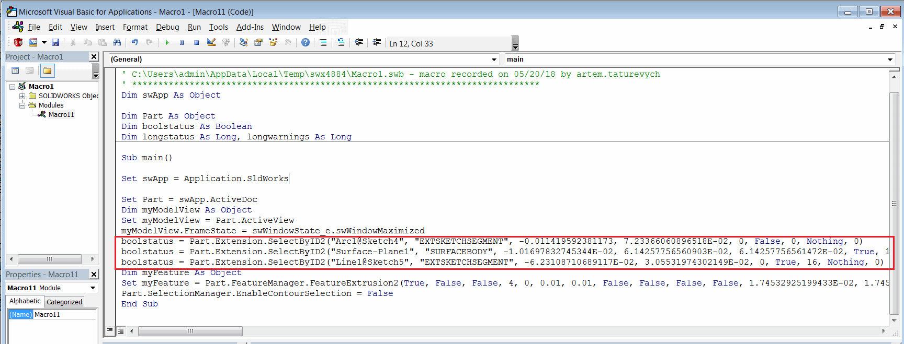

In this articles the [IModelDocExtension::SelectByID2](http://help.solidworks.com/2012/english/api/sldworksapi/solidworks.interop.sldworks~solidworks.interop.sldworks.imodeldocextension~selectbyid2.html) SOLIDWORKS API method is explained. This methods is one of the most popular ways for selecting the elements in the SOLIDWORKS either by their names or by coordinates.

This is a primary method used to represent user selections when [recording the macro](http://help.solidworks.com/2016/english/solidworks/sldworks/t_record_pause_macro.htm).

{ width=500 }

It is not recommended to use this method for the selection because of the following limitations:

* Selecting the object (elements such as Face, Vertex, Edge or Annotation) by coordinates (i.e. *Name* parameter is empty and *X*, *Y*, *Z* parameters are specified) might fail if the target entity is outside of the active view orientation. I.e. if it is not possible to select this element from the user interface at the current view position.

* Sketch elements (lines, arcs, points, splines etc.) do not have permanent names. So it is not valid to use the name recorded by the macro in SelectByID2 method.

* Incorrect object can be selected if target object is overlapped by another element when selecting by coordinates.

There are however scenarios where this method can be used:

* When selecting the objects by permanent names, i.e. features, components. It is still recommended to use direct selection methods (i.e. [IFeature::Select2](http://help.solidworks.com/2012/english/api/sldworksapi/solidworks.interop.sldworks~solidworks.interop.sldworks.ifeature~select2.html), [IComponent2::Select4](http://help.solidworks.com/2012/english/api/sldworksapi/SOLIDWORKS.Interop.sldworks~SOLIDWORKS.Interop.sldworks.IComponent2~Select4.html) SOLIDWORKS API methods)

* When selecting sheet in the drawings (there is no direct Select method in [ISheet](http://help.solidworks.com/2012/english/api/sldworksapi/solidworks.interop.sldworks~solidworks.interop.sldworks.isheet.html) interface)

* When SOLIDWORKS page is active. According to SOLIDWORKS API Help documentation (see *Remarks* section [here](http://help.solidworks.com/2012/english/api/sldworksapi/solidworks.interop.sldworks~solidworks.interop.sldworks.imodeldocextension~selectbyid2.html))

> Use this method instead of using the selection methods on the following objects: IAnnotation, IComponent2, IFeature, IFeatureManager, ISketchHatch, ISketchPoint, ISketchSegment, ISketchSpline. The previously listed objects' selection methods do not work well when a PropertyManager page is open or a command is running. This method, IModelDocExtension::SelectByID2, handles selection correctly whether or not a command is running.

* When developing the driver software for input manipulators (i.e. joystick, mouse, keypad, space mouse etc.) where it is required to translate user input directly to the graphics area.
