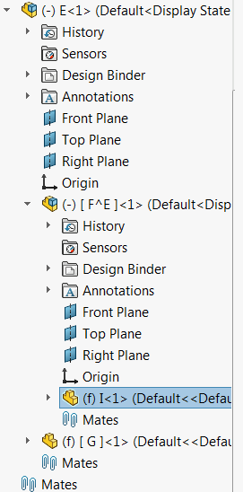
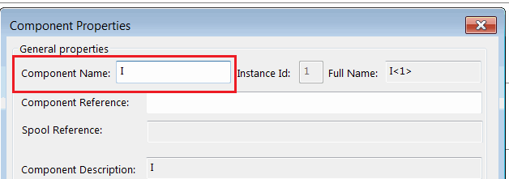

{ width=200 }

This example demonstrates the most performance efficient way to select a component on any level of the assembly by its full name using SOLIDWORKS API.

Name of the component is defined as a path where each level is separated by / symbol. Component instance id is specified with a - symbol (e.g. FirstLevelComp-1/SecondLevelComp-2/TargetComp-1)

Component name can be found in the following dialog:

{ width=250 }

Refer [Get Component By Name](/solidworks-api/document/assembly/components/get-by-name) example for macro to retrieve the pointer to the component without the selection.


